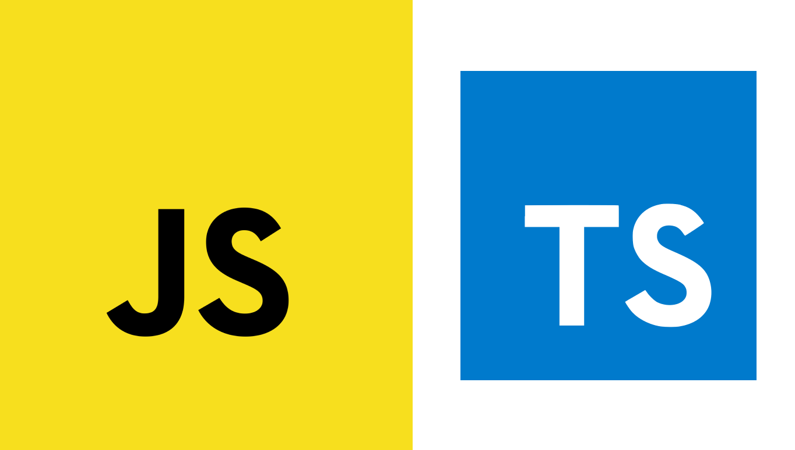

At first I felt overwhelmed by the idea of learning two languages in a short period of time, but the exercises for JavaScript weren’t that difficult. Learning JavaScript was straightforward because I had prior knowledge of other languages such as Java, C, and C++. Though for TypeScript, I had to spend a bit more time learning since it added a feature called types, making it less simple. However, one of the benefits is that types help with organizing code better. So TypeScript seems to be an upgrade for JavaScript.

## My Experience with Athletic Software Engineering

The practice WODs were useful because it helped me refresh my memory on writing code. Throughout my time in college, writing code with a time limit is a useful skill to have. So doing WODs consistently helps with improving that skill. However, the time limit does add pressure to completing it. I need to push through it since this scenario might be in an interview. 

