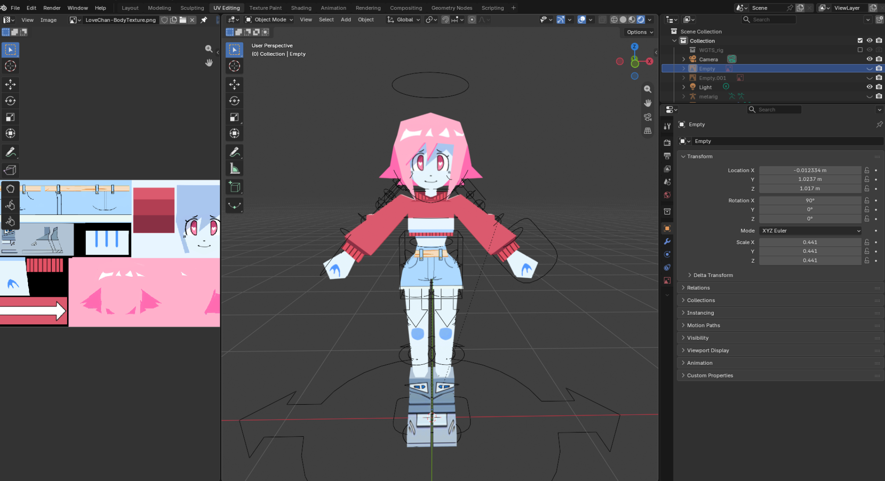

This is a low poly model I made on Blender by following a tutorial on [Youtube](https://youtu.be/Use9T2IX1XE?si=iBoN1r112yT4hoof). The purpose of this project was to learn the basics of 3D modeling. 

I decided to learn this because I want to make games someday as a hobby. I learned concepts such as UV mapping. 

