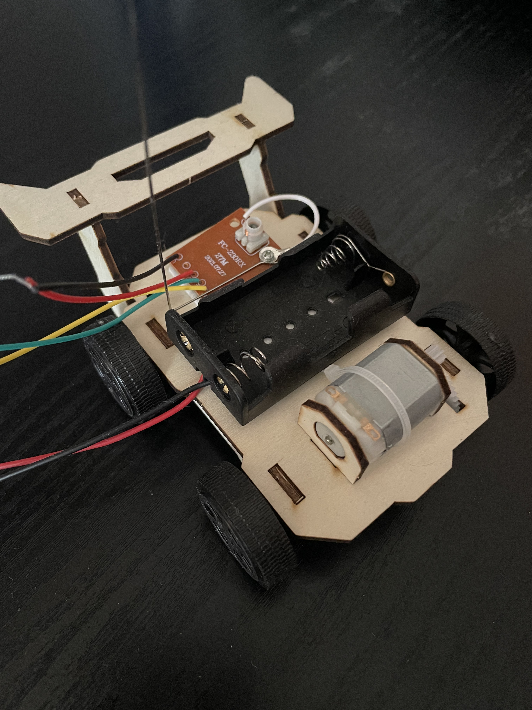

This is a RC car I made from a kit I got from Aliexpress. The purpose of this project is to learn about the basics of RC devices. I'm interested in making my own FPV drone in the future for fun.

I learned how to make a RC car because I wanted to work with something physical. It was interesting to work on a completely new thing. 

